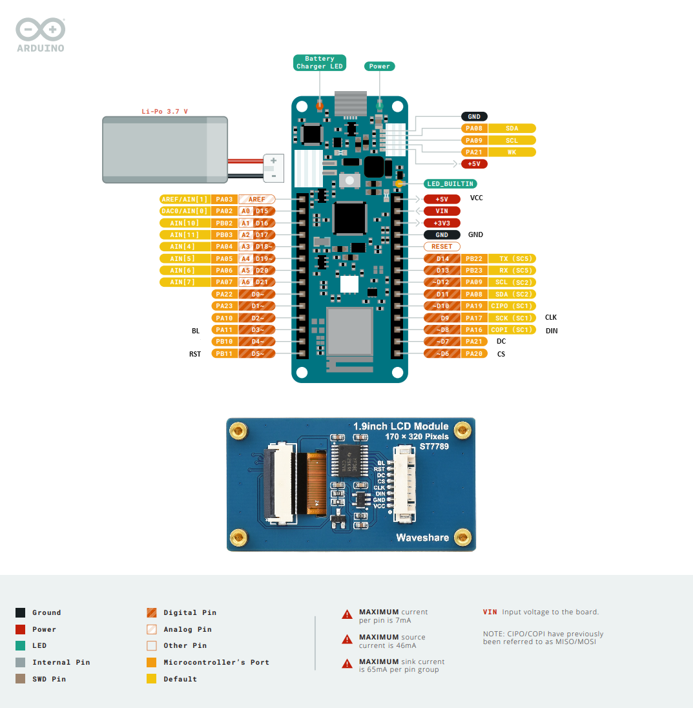

# Vanagon-HMI
## Hardware
1. Arduino MKR WiFI1010
  - Information [here](https://docs.arduino.cc/hardware/mkr-wifi-1010/)
  - PinOut

2. 1.9inch LCD Module
  - Information [here](https://www.waveshare.com/1.9inch-lcd-module.htm)
  - PinOut

## Software
### Hardware Connection
VCC ----> +5V
GND ----> GND
DIN ----> D8(COPI)
CLK ----> D9(SCK)
CS  ----> D6
DC  ----> D7
RST ----> D5
BL  ----> D3
